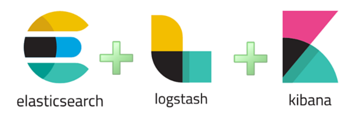

# To sum up

Up to this point, we should have managed to take, process and visualize data published by the Mexican Government regarding its contracts (here specifically with an OCDS standard).

The concepts developed for this case study can be replicated to other cases,
emphasizing the importance of Elastic platform foundations.

It is possible to process, index and visualize any open dataset with this basic knowledge.

To sum up, we highlight the following concepts:

1. There are 3 components of ELK platform: ElasticSearch, Logstash and Kibana. Each has a specific task:
    - ElasticSearch stores and indexes information, it is the "database".
    - Kibana visualizes and helps to check the information.
    - Logstash compiles, transforms and feeds the original data to ElasticSearch.
1. Once we have started an ElasticSearch server with Kibana, we can start sending documents to be indexed.
1. Logstash is a very flexible tool that can be used to take data collection, read it, transform it and later send it to ElasticSearch.
1. Logstash uses "Pipelines" to process data. This is divided in 3 parts: Input, Filter, Output.
1. Pipeline is written in its own "language" and it describes each process logically and clearly, with the capability of running complex tasks through macros.
1. Once the Pipeline is written, it can be used multiple times, even to create several indexes in the same ElasticSearch server.
