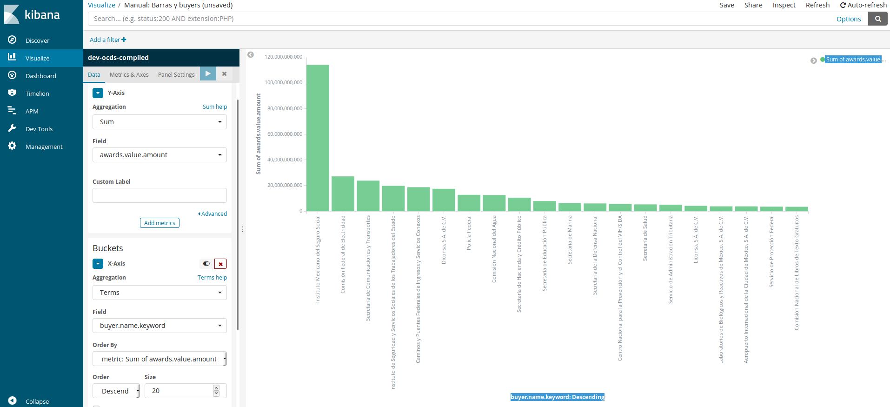
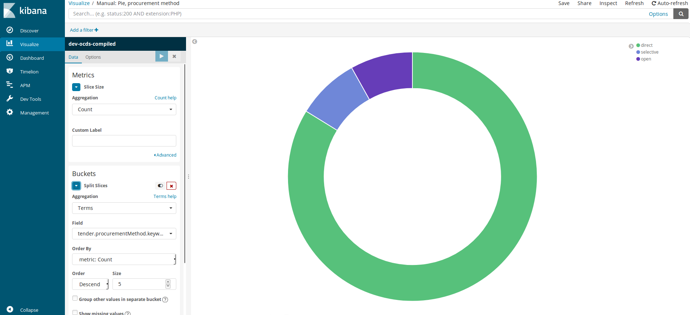
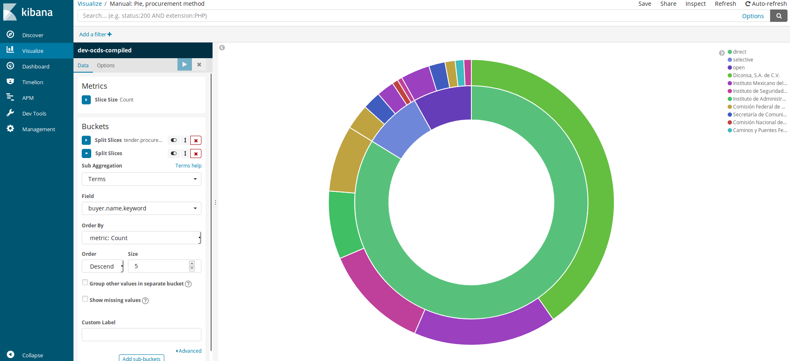
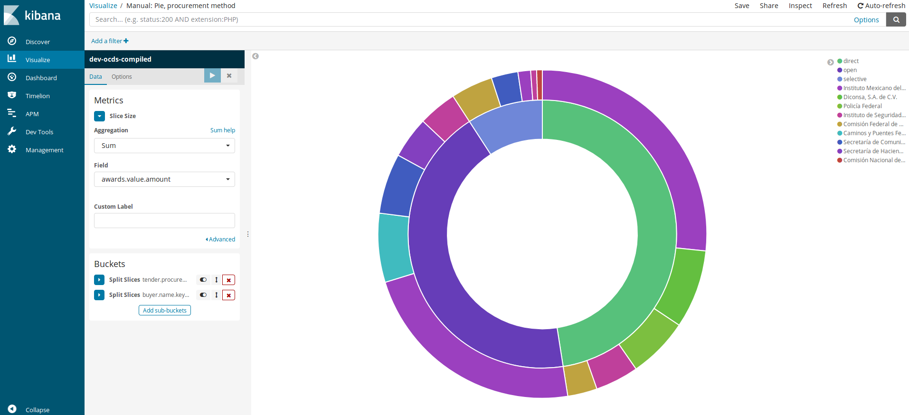
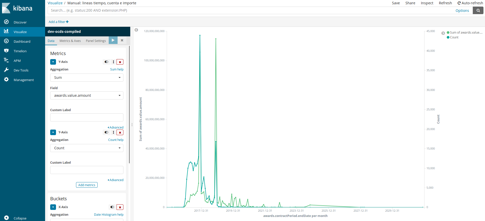

# Visualize

Kibana is a strong search engine, but it is also a powerful data visualization tool that allows us to create and save different types of graphics for data analysis.

Once you enter the visualization section, you can see a table with the already saved visualizations, and a blue button with a + symbol. When you click it, many options to work and visualize data will be displayed.  

## Bar Chart

The bar charts are used to compare the same range of data (for example, the total amount) in different instances. In this case, the government departments.  When we click this, a screen as the following will appear, with all blank values.

This is the process to replicate the graphic: * **Y-Axis**
  * *Aggregation:* Here, we will choose how data will be added to our graphic. By default, we get "Count", but we should choose the "Sum" option to get the total values. A new dropdown meny named "Field" will open, and we will select `awards.value.amount`, which is the field containing the contract value.
  * *Custom label:* The graphics's customization field.
  * *Add metric:* The blue button can be used to add another metric to Y-axis. Use this option to make a grouped bar graph.

* **Buckets / X-Axis** - There are two other options to make this graph: **Split Series** and **Split Chart**, but we will choose the first one for this graph.
  * *Aggregation:* It opens a dropdown menu with many options. Choosing "Terms" brings up a number of fields.
  * *Field*: We will choose the `buyer.name.keyword` option (you will notice there is no option without keyword).
  * *Order by*: You will order by "metric.Sum of awards.value.amount" the value we set initially, even though we could order alphabetically or define another order for the database.
  * *Order*: You will select "Descending" for the higher values to appear first. If you had selected a different option in *Order by*, the options would have been modified.
  * *Size*: For the values we are going to show in the graph, 20 is a reasonable value.
  * *Custom label:* The graphics's customization field.

When you have the panel complete, you should click play (button with blue background) and the graph will be displayed on screen. You can modify the different options to analyze in detail.

## Pie Chart

We can use the pie charts to know each element's weight (contracting procedures) out of the set (all the dataset).

This is the process to replicate the graph:
* **Metrics**
  * *Aggregation:* We will leave "Count" selected

* **Bucket / Splits Slices** since we are interested in creating the pie's slices instead of creating several pie charts.  
  * *Aggregation:* Terms again
  * *Field*: `tender.procurementMethod.keyword`
  * *Order by*: "Count"
  * *Oder* Descent
  * *Size*: We leave 5 even though there are three.

After clicking "play", a graph will be displayed. But once visualized, we want to know which departments have used this dataset more times. Therefore, we need to click the "Add sub-buckets" button that is in the Buckets section. Once there, we need to repeat the process.

* **Bucket / Splits Slices**
  * *Aggregation:* Terms again
  * *Field*: `buyer.name.keyword`
  * *Order by*: "Count"
  * *Oder* Descent
  * *Size*: We leave 5 even though there are three.

After clicking play, we will get the following graph, showing the top 5 dependencies in the dataset that had done the same type of procurement.

Moving on with the analysis, we now want to change the aggregation. We do not want it to be an operation, but the total sum per procedure and per dependency.
* **Metrics**
  * *Aggregation:* We will select the "Sum" option, and in the new *Field¨* dropdown menu, we will choose `awards.value.amount`

We click play again, which shows us the following graph:

We can continue analyzing, adding and removing values. In order to speed up the process, we have three buttons next to each "Split Slices" text that allow us to "Display/hide", "Change order of appearance" and "Delete slice". Every time we make a change, we need to click the play button.

## Line Chart

Line charts allow us to show the evolution over time. In this occasion, we will make a graph with two values: count and value.

* **Metrics**
  * *Aggregation:* We will choose the "Sum" option and `awards.value.amount` in the new *Field* dropdown menu.
  * We will click *Add metric*.
  * *Aggregation:* We will leave "Count" selected.

* **Buckets / X-Axis** - There are two other options to make this graph: **Split Series** and **Split Chart**, but we will choose the first one for this graph.
  * *Aggregation:* This time we will select "Date Histogram" since we want to make a time series.
  *Field:* We will use the  `awards.contractPeriod.endDate`, the date when the contract is awarded.
  * *Interval:* We will select "Monthly" as our dataset contains 3-year data.

If we clicked play now, the graph would just have the green line, and the blue one would be near 0 as the values between them are very different. To get a relevant graph, we need to create a second axis. o do this, click *Metrics & Axes* (the dropdown menu located to the left of play button) and in "Value Axis" dropdown menu, choose "New Axis". This will create a new axis we can edit in the following **Y-Axis** box.

If we observe the graphic, we can notice it ends in 2020, when we are still in 2018. We can add a filter to the data in order to amend this, as we do in [Discover](https://manualkibanaocds.readthedocs.io/es/latest/C3/Seccion2.html).

## Other graphs available

In Kibana, we have many more options to create graphs. All of them with performances very similar to the previously described. Some recommended ones are:

* **Tables**: Allows us to create new tables and export them to csv.
* **Area**: For values accumulated over time.
* **Maps**: For geographical values.
* **Networks**: To explore the links between different fields.
